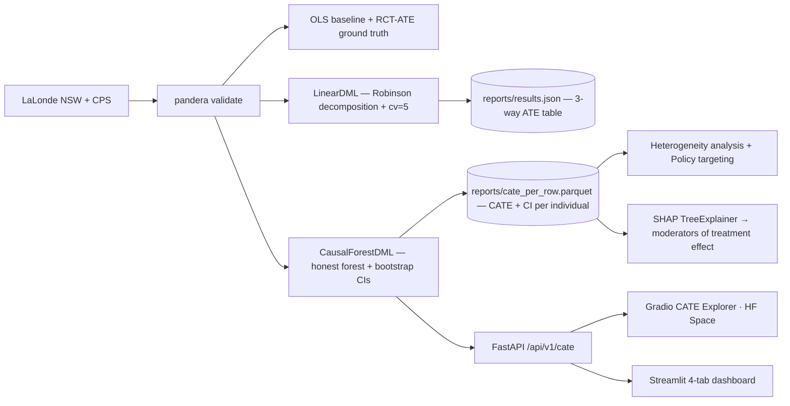
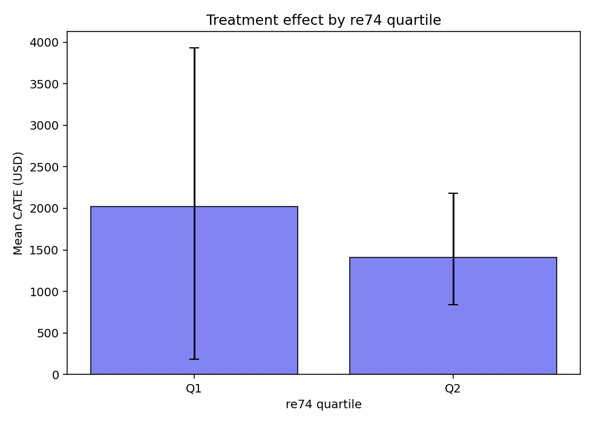
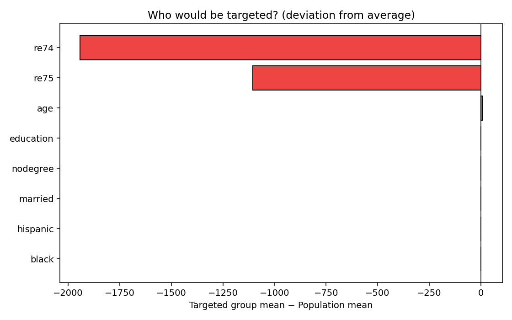

# Does Job Training Actually Work? — Causal ML & Heterogeneous Treatment Effects

> **The naive answer: −$8,497.** Job training appears to *hurt* earnings.
> **The true answer: +$1,794.** Job training genuinely helps — the naive number is pure statistical bias.
> This project shows exactly why, who benefits most, and how to target a limited budget.

[](https://huggingface.co/spaces/Priyrajsinh/causal-ml-hte-cate-explorer)
[](https://causal-ml-hte-priyrajsinh.streamlit.app)
[](https://github.com/Priyrajsinh/causal-ml-hte/actions/workflows/ci.yml)
[](LICENSE)

---

## What it does

Imagine you run a government job-training programme and you have to answer one question: **did the training actually raise the participants' earnings?** Answering it honestly from real-world data is deceptively hard — the people who enrol are systematically different from the people who don't, so a naive comparison measures *who they were* rather than *what the programme did*. This project takes the canonical **LaLonde** labour-market data, shows how a naive regression produces a badly biased (even *negative*) answer, and then uses **Double Machine Learning** to recover the true effect — the same number a randomised trial found. It then goes one step further with a **causal forest** to estimate a personalised effect for every individual, so a budget-constrained programme can target the people who gain the most.

---

## Live demos

| Demo | What you can do | Link |
|------|-----------------|------|
| **🤗 Gradio CATE Explorer** (HF Space) | Enter a profile — age, education, prior earnings, demographics — and get a personalised treatment effect with a 95% bootstrap CI and a plain-English TREAT / DEFER recommendation. | [Open](https://huggingface.co/spaces/Priyrajsinh/causal-ml-hte-cate-explorer) |
| **📊 Streamlit dashboard** (Streamlit Cloud) | 4 tabs: ATE bias-vs-recovery story · embedded CATE explorer + SHAP moderators · heterogeneity breakdown · policy targeting. | [Open](https://causal-ml-hte-priyrajsinh.streamlit.app) |
| **⚡ FastAPI / Swagger** (local) | `POST /api/v1/cate`, `GET /api/v1/ate_comparison`, `/metrics`. Interactive docs at `/docs`. | `make serve` → http://localhost:8000/docs |

---

## Quick start

```bash
git clone https://github.com/Priyrajsinh/causal-ml-hte
cd causal-ml-hte
py -3.12 -m venv venv
venv\Scripts\activate          # Windows
# source venv/bin/activate     # macOS / Linux

make install                   # deps + pre-commit hooks
make train                     # download data + fit LinearDML + CausalForestDML
make evaluate                  # OLS-vs-DML ATE table + CATE histogram + SHAP
make heterogeneity             # CATE by education / age / re74 + policy targeting
make explain                   # SHAP moderators of treatment effect
make serve                     # FastAPI  → http://localhost:8000/docs
make streamlit                 # dashboard → http://localhost:8501
make gradio                    # local CATE explorer → http://localhost:7860
make audit                     # pip-audit + detect-secrets + bandit
make ci                        # the full gate (run before every push)
```

---

## Architecture



---

## The headline result — OLS bias vs DML recovery

A randomised controlled trial (the **NSW** dataset) is unbiased by construction: it found job training raised 1978 earnings by **+$1,794**. The challenge is whether a method can recover that truth from the *observational* **CPS** construction, where the treated group (formerly unemployed) is compared against a population control group (largely employed) — a textbook selection-bias trap.

| Estimator | ATE ($) | 95% CI | Note |
|---|---|---|---|
| OLS · CPS (unadjusted) | **−8,497** | [−9,893, −7,102] | naive, confounded — training "appears" to hurt |
| OLS · CPS (adjusted) | **+699** | [−374, +1,773] | controls help but CI still crosses zero — biased |
| DML · CPS | **−3,591** | [−8,475, +1,293] | honest about its own uncertainty on hard data |
| DML · NSW | **+1,834** | [+513, +3,155] | sanity check — recovers the RCT truth on RCT data |
| **RCT ground truth (NSW)** | **+1,794** | [+542, +3,113] | unbiased by construction (gold standard) |


**The narrative (rule C40 — never present naive OLS as the causal estimate):** unadjusted OLS on the observational data says training *destroys* −$8,497 of earnings. That is selection bias, not causation. DML on the *same* RCT data lands at +$1,834 — statistically indistinguishable from the +$1,794 ground truth. The bias *is* the story.

### How Double ML recovers the truth

DML (Chernozhukov et al. 2018) is the **Robinson (1988) decomposition** with machine-learning nuisance models:

1. Predict the **outcome** (1978 earnings) from covariates with LightGBM; take the residual.
2. Predict the **treatment** from the same covariates with LightGBM; take the residual.
3. Regress residual-outcome on residual-treatment — the confounding cancels, leaving pure causal signal.

Both nuisance models are fit with **5-fold cross-fitting** (`cv=5`). That cross-fitting is the orthogonality guarantee that lets you plug in flexible ML models without contaminating the causal estimate — it is mathematics, not a heuristic.

---

## Heterogeneity — who benefits more?

The +$1,794 average hides large variation. **CausalForestDML** (Athey & Wager 2019) estimates a personalised **CATE** (Conditional Average Treatment Effect) for every individual.




**Moderator strength (CATE range across covariate bins):**

| Covariate | CATE range | Min → Max |
|---|---|---|
| **age** | **$2,455** | $776 (youngest) → $3,231 (oldest) |
| education | $1,564 | $1,088 (≤9 yrs) → $2,652 (>11 yrs) |
| nodegree | $998 | $1,654 → $2,652 |
| married | $631 | $1,765 → $2,396 |
| re74 | $611 | $1,413 → $2,024 |

**Top moderator: age.** Older participants gain dramatically more from training (+$3,231 in the oldest quartile vs +$776 in the youngest) — plausibly because the programme substitutes for labour-market experience the youngest applicants have not yet accumulated. Education is the second-strongest moderator.

---

## Policy targeting — does it matter who you enrol?

If a budget only funds 30% of applicants, should you pick randomly or target the highest predicted CATE?




| Targeting strategy | Mean CATE | Total earnings lift (134 people) |
|---|---|---|
| Whole-population average | $1,794 | — |
| Untargeted (bottom 70%) | $1,157 | — |
| **Top-30% by predicted CATE** | **$3,528** | **$472,801** |

Targeting on individual CATE predictions delivers a **$3,528 average lift** in the funded group — roughly **3× the lift of the people you would leave out** — for the same programme budget.

---

## How SHAP on a causal forest differs from SHAP on a predictive model

This distinction is the intellectual core of the project, so it is worth being precise.

SHAP on a *predictive* model (say, a RandomForest predicting 1978 earnings) measures **outcome drivers** — which features tell you what someone's earnings *will be*. SHAP on a *causal forest* (whose prediction is the CATE) measures **moderators of treatment effect** — which features tell you *who gains the most from the intervention*. They answer different questions and routinely give different rankings.

Take `re74` (1974 earnings). It is a powerful **outcome driver**: if you earned $15,000 in 1974, you will very likely earn a lot in 1978 too, so `re74` would dominate a predictive SHAP plot. But on the *causal* SHAP plot `re74` is comparatively **flat** ($611 of CATE range) — the training helps low-prior-earners and high-prior-earners by broadly similar amounts, so knowing someone's 1974 income tells you where they *started*, not how much *extra* they will gain. Meanwhile `age` and `education` rise to the top of the causal plot precisely because the *gain from training* genuinely varies with them.

This matters in production because policy targeting *is* the causal-SHAP question: of two equally qualified candidates, which one gains more from being enrolled? A predictive SHAP plot, optimised to guess final earnings, would steer you toward "the candidate who needs the least help" — which is exactly backwards for a programme meant to close gaps. Ask "moderator," not "driver," whenever a budget constraint forces you to choose who to treat first.


By mean |SHAP| on the CATE, **age** (933) is the strongest moderator, then **education** (379) — consistent with the quartile table above, and notably *not* the same as a pure earnings-prediction ranking would produce.

---

## Responsible-AI framing — EU AI Act, Annex III §4 (Employment)

A treatment-effect estimator used to target a job-training programme is **high-risk** under the EU AI Act: **Annex III §4** covers *"AI systems intended to be used for … decisions affecting terms of work-related relationships … or for monitoring and evaluating performance"*, and active-labour-market enrolment decisions fall squarely inside it. Mapping the relevant articles to what this repo actually implements:

- **Article 9 — Risk management.** A coverage-drift monitor exposes `cate_distribution_drift_total`, `cate_mean_gauge`, and `cate_std_gauge` on `/metrics` (PSI > 0.2 alarm). A CI test (rule C37) fails the build if the NSW DML confidence interval ever drifts away from the $1,794 RCT ground truth — the estimator cannot silently regress.
- **Article 10 — Data and data governance.** Every NSW/CPS DataFrame is validated by the pandera `LALONDE_SCHEMA` *before* any estimation; both raw CSVs are DVC-tracked with SHA-256 checksum sidecars, and the three-data-source layout (no train/test split — DML cross-fits internally) is documented in `CLAUDE.md`.
- **Article 13 — Transparency.** Every `/api/v1/cate` response carries an `nl_summary` that translates the estimate into a human-readable recommendation; Streamlit Tab 1 shows the bias-vs-recovery story explicitly, so a user sees *why* the recommendation should be trusted.
- **Article 14 — Human oversight.** Every "TREAT" surfaces its 95% bootstrap CI so a case-worker sees the uncertainty and can override; ambiguous cases (CI crossing zero) auto-route to "DEFER" — the equivalent of "escalate to a human".
- **Article 11 / Annex III §4 — Technical documentation.** Because the system is high-risk, Article 11 requires technical documentation: that document is [`MODEL_CARD.md`](MODEL_CARD.md), carrying the headline ATE table, heterogeneity audit, moderator analysis, and the training-serving skew note.

*This is engineering framing, not a legal opinion. A real deployment would additionally require conformity assessment, post-market monitoring, and CE marking — out of scope for this portfolio project.*

---

## Tech stack

| Layer | Tools |
|---|---|
| Causal estimation | EconML (`LinearDML`, `CausalForestDML`) |
| Nuisance / ML models | LightGBM (`LGBMRegressor`, `LGBMClassifier`) |
| Explainability | SHAP `TreeExplainer` (moderators of treatment effect) |
| Validation | pandera (`LALONDE_SCHEMA`), Pydantic v2 |
| Experiment tracking | MLflow |
| Serving | FastAPI · slowapi (rate limit) · Prometheus (`/metrics`) |
| Demos | Gradio (HF Space) · Streamlit (Cloud) |
| Data versioning | DVC + SHA-256 checksums |
| Quality gate | black · isort · flake8 · mypy · bandit · radon · interrogate · pip-audit · detect-secrets · pytest |

---

## Project structure

```
causal-ml-hte/
├── app.py                          # Streamlit dashboard (Streamlit Cloud)
├── hf_space/app.py                 # Self-contained Gradio Space (HF)
├── src/
│   ├── models/
│   │   ├── dml_model.py            # LinearDML + LightGBM nuisance
│   │   └── causal_forest_model.py  # CausalForestDML + bootstrap CIs
│   ├── baseline/baseline_ols.py    # Naive OLS (the bias demonstration)
│   ├── evaluation/
│   │   ├── cate_plots.py           # CATE histogram + caterpillar
│   │   └── shap_moderators.py      # SHAP on the causal forest
│   ├── heterogeneity/
│   │   ├── analysis.py             # CATE by quartile + scatter
│   │   └── policy.py               # Top-K% policy curve + Qini
│   └── api/
│       ├── app.py                  # FastAPI — POST /api/v1/cate
│       └── gradio_demo.py          # Local Gradio twin of HF Space
├── reports/
│   ├── results.json                # All computed results (committed)
│   └── figures/                    # All plots (committed)
├── research-notes/                 # Reading log — DML, causal forest, LaLonde, EU AI Act
├── MODEL_CARD.md                   # Technical documentation (EU AI Act Art. 11)
└── tests/                          # Unit + integration + docs invariants
```

---

## References

- Chernozhukov, V., Chetverikov, D., Demirer, M., Duflo, E., Hansen, C., Newey, W., & Robins, J. (2018). Double/Debiased Machine Learning for Treatment and Structural Parameters. *The Econometrics Journal*, 21(1), C1–C68. arXiv:1608.00060
- Athey, S., & Wager, S. (2019). Estimating Treatment Effects with Causal Forests: An Application. *Observational Studies*, 5(2), 37–51. arXiv:1902.07409
- LaLonde, R. J. (1986). Evaluating the Econometric Evaluations of Training Programs with Experimental Data. *American Economic Review*, 76(4), 604–620.
- Dehejia, R. H., & Wahba, S. (1999). Causal Effects in Nonexperimental Studies: Reevaluating the Evaluation of Training Programs. *Journal of the American Statistical Association*, 94(448), 1053–1062.
- Imbens, G. W., & Rubin, D. B. (2015). *Causal Inference for Statistics, Social, and Biomedical Sciences: An Introduction*. Cambridge University Press. ISBN 978-0-521-88588-8.

---

## Citation

```bibtex
@misc{parmar2026causal_ml_hte,
  author       = {Parmar, Priyrajsinh},
  title        = {Causal ML for Heterogeneous Treatment Effects:
                  Recovering the LaLonde RCT Effect with Double Machine Learning},
  year         = {2026},
  howpublished = {\url{https://github.com/Priyrajsinh/causal-ml-hte}},
  note         = {Double ML + Causal Forest on the LaLonde NSW/CPS data}
}
```

---

## License

Released under the [MIT License](LICENSE).

---

*Built by [Priyrajsinh Parmar](https://github.com/Priyrajsinh) · Python 3.12 · EconML · LightGBM · SHAP · FastAPI · Gradio · Streamlit*
