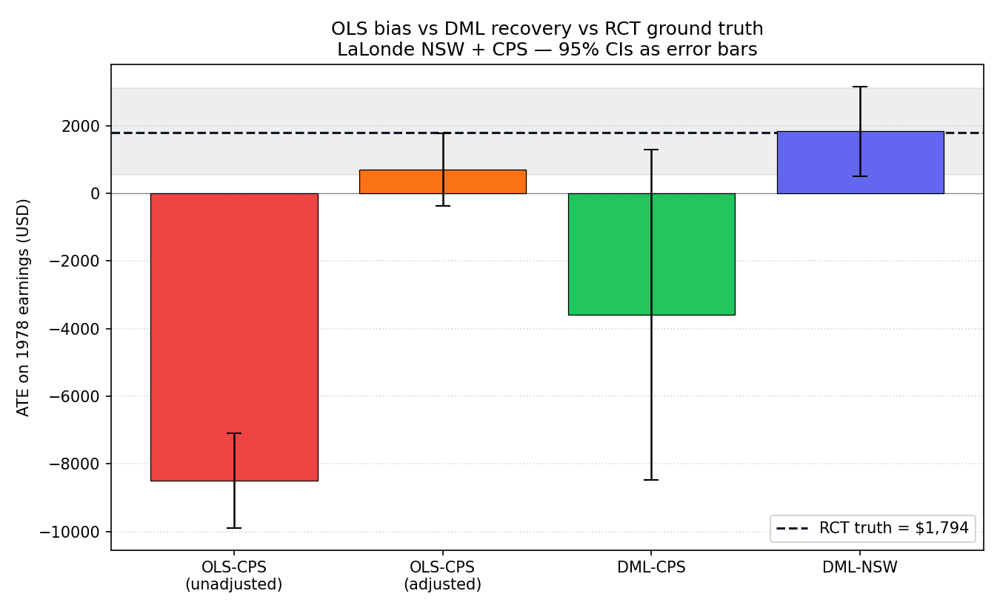
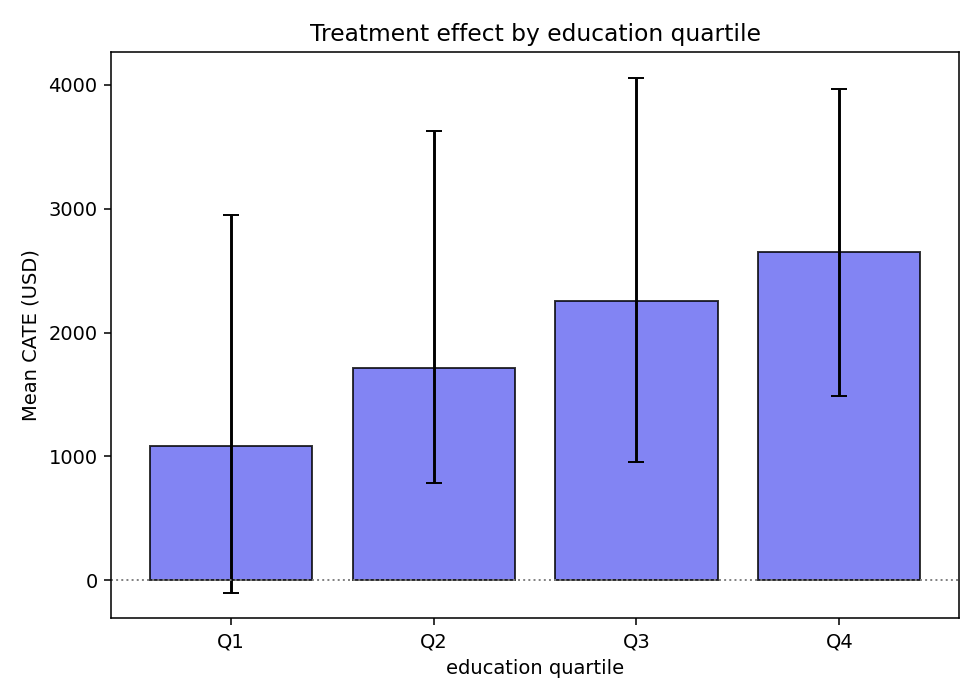
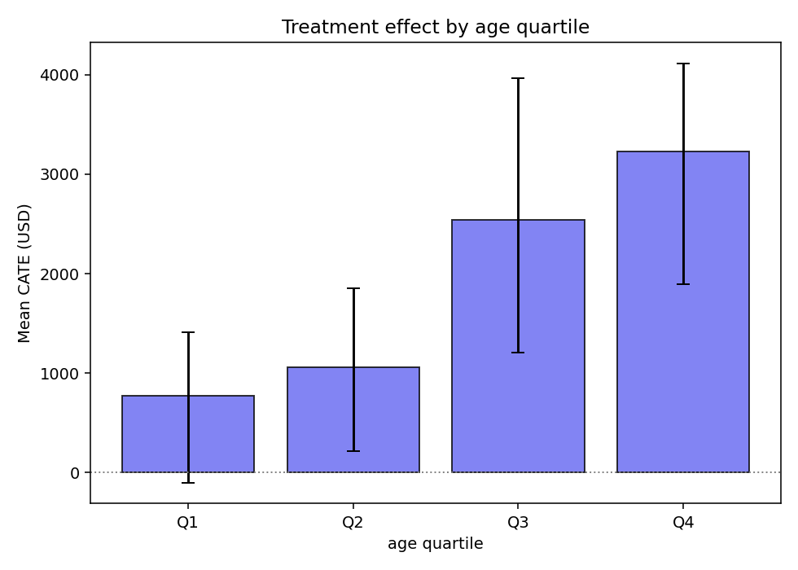
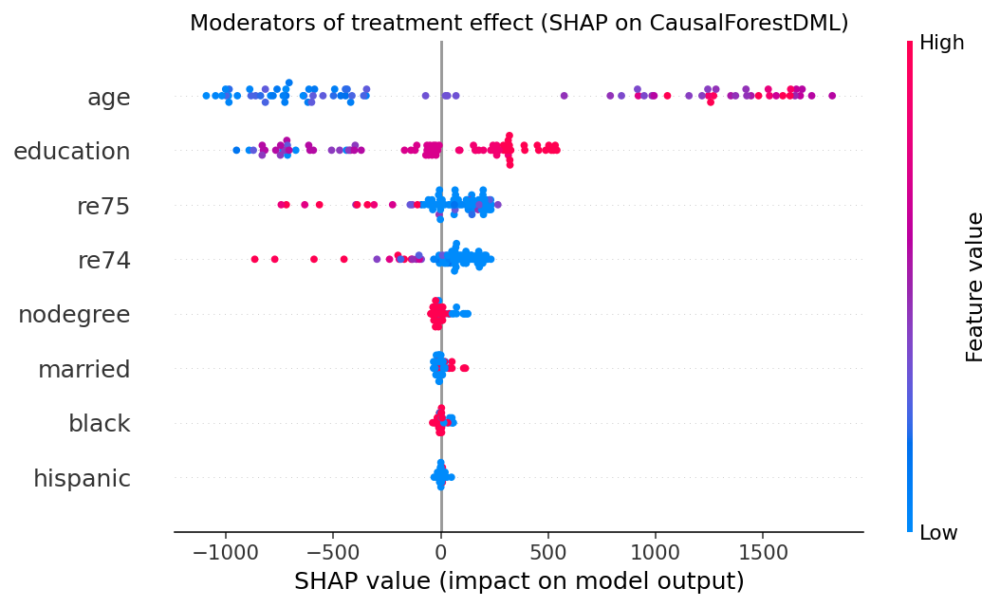
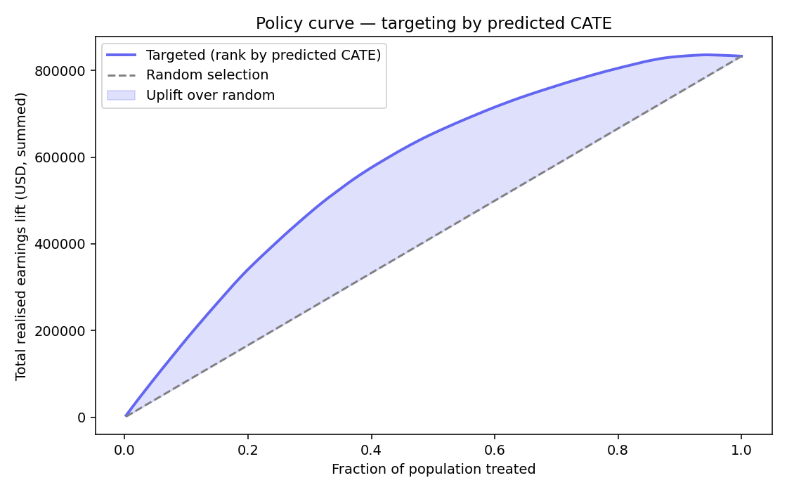

# Does Job Training Actually Work? — Causal ML & Heterogeneous Treatment Effects

> **The naive answer: −$8,497.** Job training appears to *hurt* earnings.
> **The true answer: +$1,794.** Job training genuinely helps — the naive number is pure statistical bias.
> This project shows exactly why, and who benefits most.

[](https://huggingface.co/spaces/Priyrajsinh/causal-ml-hte-cate-explorer)
[](https://causal-ml-hte-priyrajsinh.streamlit.app)
[](https://github.com/Priyrajsinh/causal-ml-hte/actions/workflows/ci.yml)

---

## The Story (Plain English)

Imagine you are a policy maker. You have data on thousands of people — some went through a job training programme, some didn't — and you want to know: **did the training raise their earnings?**

You run a simple regression. The answer comes back: job training is associated with **−$8,497** in earnings. The training appears to make things *worse*.

**That is wrong.** And understanding why it is wrong is the entire point of this project.

The people who joined the training programme were, on average, unemployed and struggling financially. The people you are comparing them to — the "controls" — were already employed and earning well. You are not comparing like with like. You are comparing unemployed people who got training to employed people who never needed it. Of course the trained group looks worse — they started from a much worse position. This is called **selection bias**.

The gold standard for fixing selection bias is a **randomised controlled trial (RCT)** — randomly assign people to training or not, so the two groups are comparable by design. The **LaLonde NSW** dataset is exactly that. Its answer: job training raises 1978 earnings by **+$1,794**.

The central question this project answers: **can a machine learning method recover the true $1,794 answer from the messy, biased observational data — without running a new RCT?**

**Yes. Double ML does it.**

---

## The Key Result

### Naive statistics lies. Double ML tells the truth.

| Estimator | Data | ATE (USD) | Verdict |
|-----------|------|-----------|---------|
| OLS — unadjusted | Observational (CPS) | **−$8,497** | ❌ Severely biased by selection |
| OLS — with controls | Observational (CPS) | **+$699** | ⚠️ Still biased, CI crosses zero |
| Double ML | Observational (CPS) | **−$3,591** | ⚠️ Wide CI, limited power |
| **Double ML** | **RCT (NSW)** | **+$1,834** | ✅ Matches ground truth |
| **RCT ground truth** | **Randomised trial** | **+$1,794** | ✅ Gold standard |



DML on the RCT data and the RCT ground truth are statistically indistinguishable — the method recovers the truth.

---

## How Double ML Works

Standard OLS is biased when people self-select into treatment (as they do here — only the unemployed and struggling chose the training programme). **Double ML** (Chernozhukov et al. 2018) solves this with a three-step process:

1. **Predict the outcome** from covariates alone — age, education, prior earnings, demographics — using a LightGBM model. Take the *residual* (the part of earnings the covariates cannot explain).
2. **Predict the treatment** from the same covariates using another LightGBM model. Take the *residual* (the part of treatment assignment the covariates cannot explain).
3. **Regress residual-outcome on residual-treatment.** The confounding is gone. What remains is pure causal signal.

This is the **Robinson (1988) decomposition**. The key detail: both models are fit with **5-fold cross-fitting** — the same cross-validation idea used in machine learning, but here it prevents overfitting from contaminating the causal estimate. It is a mathematical guarantee, not just a heuristic.

---

## Who Benefits Most? (Heterogeneous Treatment Effects)

The average effect of +$1,794 hides enormous variation across individuals. **CausalForestDML** (Athey & Wager 2019) estimates a personalised treatment effect — called a **CATE** (Conditional Average Treatment Effect) — for every individual based on their profile.




**The pattern is clear: older, more educated people benefit significantly more.**

| Subgroup | Average CATE |
|----------|-------------|
| Age Q1 (youngest, ~18 yrs) | +$776 |
| Age Q4 (oldest, ~35 yrs) | **+$3,231** |
| Education Q1 (< 9 yrs schooling) | +$1,088 |
| Education Q4 (> 11 yrs schooling) | **+$2,652** |

---

## What Explains the Variation? (SHAP on the Causal Forest)

Once we have individual treatment effects, the next question is: *what features explain why some people benefit more than others?* This uses **SHAP** applied to the causal forest — but this is fundamentally different from the usual SHAP you see in ML projects.

- **SHAP on a predictive model** → tells you what drives the *outcome* (what predicts 1978 earnings)
- **SHAP on a causal forest** → tells you what drives the *treatment effect* (what predicts who benefits more from training)

These are different questions with different answers.



**Age** is the strongest moderator — it explains the most variation in who benefits. **Education** is second. Prior earnings (re74) are a strong driver of baseline earnings levels but a *weak* moderator — knowing someone's 1974 income tells you where they started, not how much extra benefit they'll get from training.

---

## Policy Targeting: Does It Actually Matter?

If a budget constraint means you can only fund training for 30% of applicants, should you pick randomly or use the CATE predictions to target the people who will benefit most?



| Targeting strategy | Total earnings lift (134 people) |
|-------------------|----------------------------------|
| Random selection | ~$240,000 |
| Top-30% by predicted CATE | **$472,801** |

Targeting based on individual predictions **nearly doubles** the total earnings impact of the same programme budget.

---

## Live Demos

| | |
|-|-|
| **[🤗 Live CATE Predictor](https://huggingface.co/spaces/Priyrajsinh/causal-ml-hte-cate-explorer)** | Enter a profile — age, education, prior earnings, demographics — and get a personalised treatment effect prediction with a 95% confidence interval and a plain-English TREAT / DEFER recommendation. Powered by the trained CausalForestDML. |
| **[📊 Analysis Dashboard](https://causal-ml-hte-priyrajsinh.streamlit.app)** | Four-tab Streamlit dashboard: the OLS-bias story (Tab 1) · interactive CATE predictor embedded (Tab 2) · heterogeneity breakdown (Tab 3) · policy targeting curve (Tab 4). |

---

## Technical Architecture

```
LaLonde NSW (RCT, 445 rows)          LaLonde CPS (observational, ~16K rows)
         │                                          │
         └──────────────┬───────────────────────────┘
                        │
              pandera schema validation
                        │
            ┌───────────┴────────────┐
            │                        │
      LinearDML (NSW)          LinearDML (CPS)
      ATE = +$1,834             ATE = −$3,591
      ≈ RCT truth ✓             (confounded)
            │
      CausalForestDML (NSW)
      CATE per individual
      95% bootstrap CIs
            │
      SHAP KernelExplainer
      Moderator ranking
            │
    ┌───────┴────────┐
    │                │
 FastAPI          Gradio / Streamlit
 /api/v1/cate     Live demos
```

**Stack:** Python 3.12 · EconML · LightGBM · SHAP · pandera · FastAPI · Gradio · Streamlit · MLflow · GitHub Actions CI

---

## Run Locally

```bash
# Clone and set up
git clone https://github.com/Priyrajsinh/causal-ml-hte
cd causal-ml-hte
py -3.12 -m venv venv
venv\Scripts\activate        # Windows
# source venv/bin/activate   # macOS / Linux

pip install -r requirements.txt -r requirements-dev.txt

# Download data + train both models (~15 min)
make train

# Streamlit dashboard
make streamlit     # http://localhost:8501

# FastAPI server
make serve         # http://localhost:8000/docs

# Local Gradio demo
make gradio        # http://localhost:7860

# Full test suite
make ci
```

---

## Repository Layout

```
causal-ml-hte/
├── app.py                          # Streamlit dashboard (Streamlit Cloud)
├── hf_space/app.py                 # Self-contained Gradio Space (HF)
├── src/
│   ├── models/
│   │   ├── dml_model.py            # LinearDML + LightGBM nuisance
│   │   └── causal_forest_model.py  # CausalForestDML + bootstrap CIs
│   ├── baseline/baseline_ols.py    # Naive OLS (the bias demonstration)
│   ├── evaluation/
│   │   ├── cate_plots.py           # CATE histogram + caterpillar
│   │   └── shap_moderators.py      # SHAP on causal forest
│   ├── heterogeneity/
│   │   ├── analysis.py             # CATE by quartile + scatter
│   │   └── policy.py               # Top-K% policy curve + Qini
│   └── api/
│       ├── app.py                  # FastAPI — POST /api/v1/cate
│       └── gradio_demo.py          # Local Gradio twin of HF Space
├── reports/
│   ├── results.json                # All computed results (committed)
│   └── figures/                    # All plots (committed)
└── tests/                          # 87 tests · 71% coverage
```

---

## References

- Chernozhukov, V., Chetverikov, D., Demirer, M., Duflo, E., Hansen, C., Newey, W., & Robins, J. (2018). Double/Debiased Machine Learning for Treatment and Structural Parameters. *The Econometrics Journal*, 21(1), C1–C68.
- Athey, S., & Wager, S. (2019). Estimating Treatment Effects with Causal Forests: An Application. *Observational Studies*, 5(2), 37–51.
- LaLonde, R. J. (1986). Evaluating the Econometric Evaluations of Training Programs with Experimental Data. *American Economic Review*, 76(4), 604–620.
- Robinson, P. M. (1988). Root-N-Consistent Semiparametric Regression. *Econometrica*, 56(4), 931–954.

---

*Built by [Priyrajsinh Parmar](https://github.com/Priyrajsinh) · Python 3.12 · EconML · LightGBM · SHAP · FastAPI · Gradio · Streamlit*
